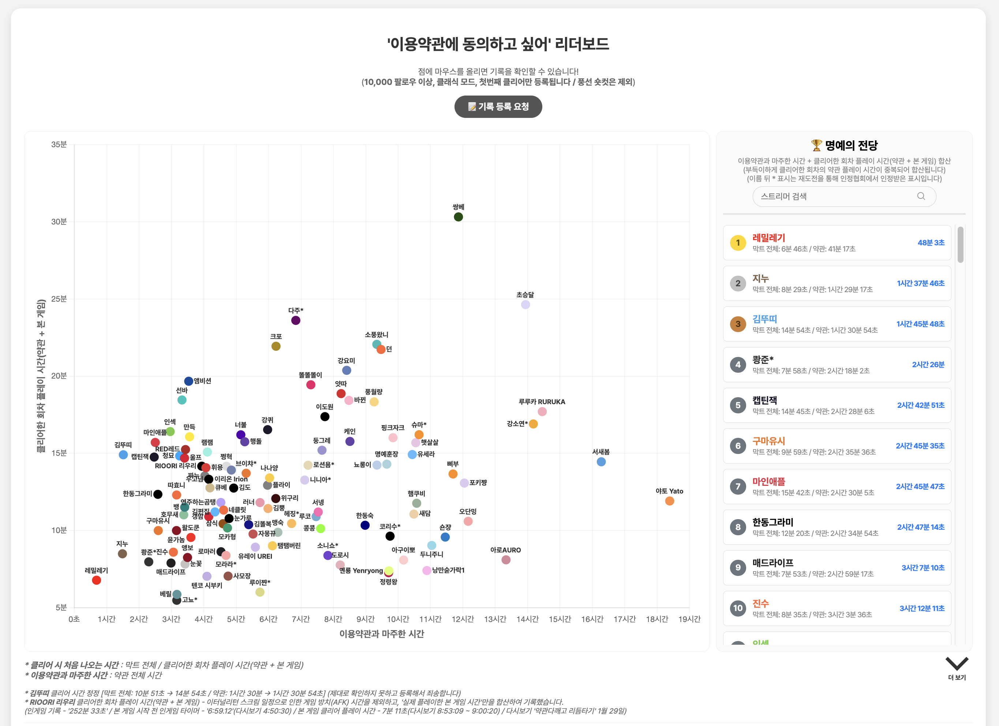
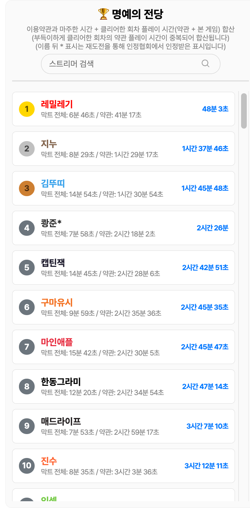
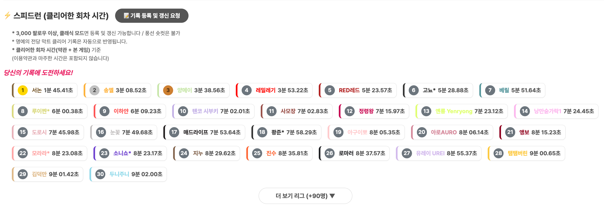
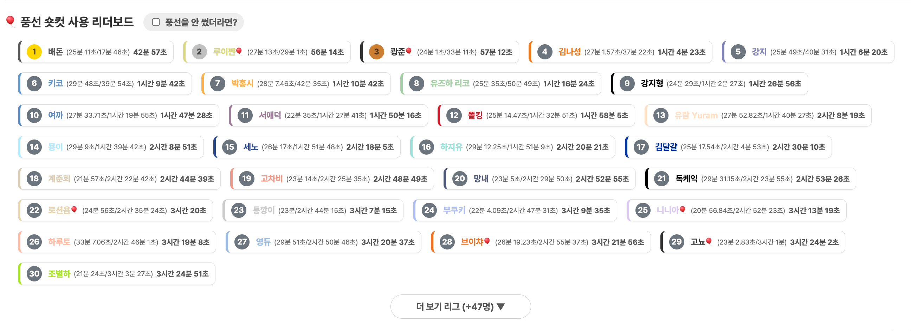
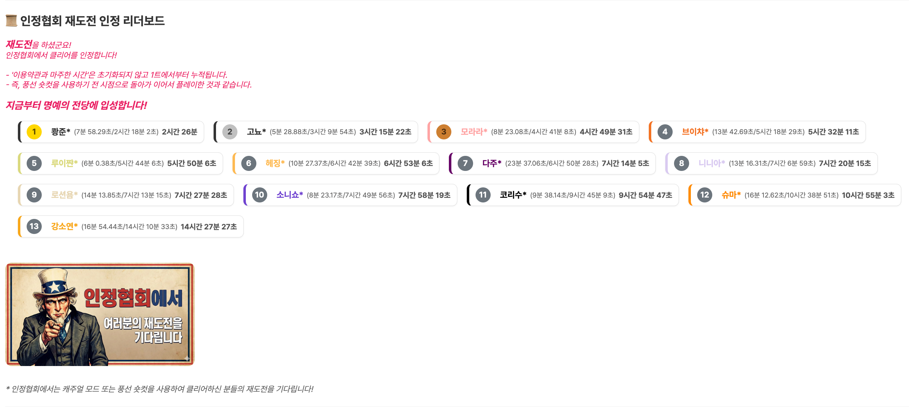
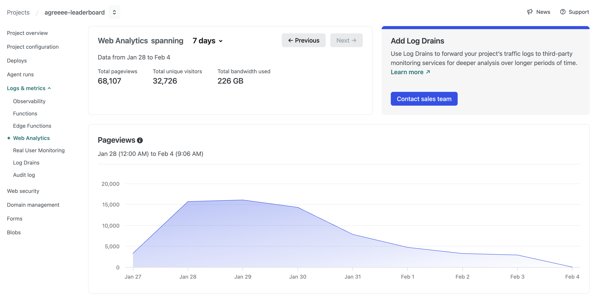
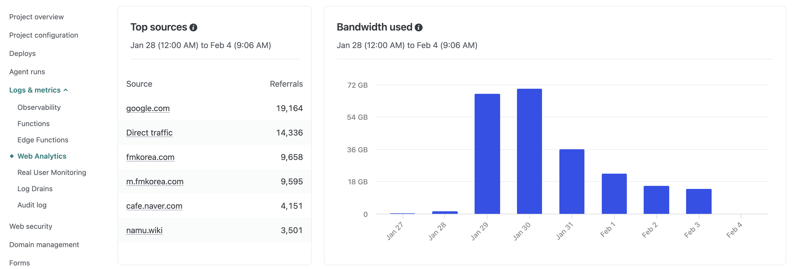

# 🏆 '이용약관에 동의하고 싶어' 스트리머 리더보드

네이버 스트리밍 플랫폼 치지직 스트리머(인터넷 방송인)들의 **'이용약관에 동의하고 싶어'** 게임 클리어 기록을 시각화하고 모아둔 웹 리더보드 프로젝트입니다.

🔗 **Live Demo:** [https://agreeee-leaderboard.netlify.app](https://agreeee-leaderboard.netlify.app)

  

## ✨ 주요 기능

- **기록 시각화 차트:** '이용약관과 마주한 시간'을 X축, '클리어한 회차 플레이 시간(본 게임 시간)'을 Y축으로 둔 산점도 차트를 제공합니다.
- **스트리머 검색:** 수많은 기록 중에서 특정 스트리머의 이름을 검색해 위치를 빠르게 찾고 하이라이트 할 수 있습니다.

### 🏆 분할 리그 시스템

기록의 공정성과 다양한 재미를 위해 플레이 방식에 따라 리그를 분할하여 제공합니다.

#### 1. 명예의 전당 (Hall of Fame)

  

- **조건:** 10,000 팔로워 이상, 클래식 모드 첫 클리어 기록
- 수많은 시청자들 앞에서 험난한 이용약관을 뚫고 첫 클리어를 달성한 대형 스트리머들의 끈기와 노력이 담긴 명예로운 리더보드입니다.

#### 2. 스피드런 (Speedrun)

  

- **조건:** 3,000 팔로워 이상, 클래식 모드 (풍선 숏컷 제외)
- 오직 **'순수 클리어 회차 시간'** 만으로 한계에 도전하는 스피드런 리그입니다.

#### 3. 풍선 숏컷 사용 리더보드

  

- 풍선 숏컷을 사용하여 클리어한 유저들을 위해 별도로 마련된 리더보드입니다.

#### 4. 재도전 인정 리더보드

  

- 캐주얼 모드나 풍선 숏컷을 사용했던 유저가 클래식 모드로 **재도전**하여 클리어한 기록입니다.
- 1회차 클리어 때 소요된 이용약관 시간을 초기화하지 않고 누적 합산하여 '인정협회'의 엄격한 기준을 통과한 명예로운 기록들입니다.

## 📊 트래픽 및 성과

단일 게임 팬 웹사이트임에도 배포 직후 많은 분들의 관심을 받아 꽤 높은 트래픽을 기록했습니다.

  

  

- **집계 기간:** 2026년 1월 28일 ~ 2월 4일 (7일간)
- **방문자 성과:** 총 68,107회의 페이지뷰(Pageviews)와 32,726명의 순 방문자(Unique Visitors) 달성
- **주요 유입 경로:** 구글 검색(19,164회), 직접 유입(14,336회)을 비롯해 에펨코리아, 네이버 팬카페, 나무위키 등 여러 커뮤니티를 통해 성공적으로 바이럴이 되었습니다.
- **대역폭 사용량:** 트래픽이 몰렸던 1월 29일~30일 이틀 동안만 하루 70GB 이상, 총 226GB의 대역폭을 소화했습니다.

## 📝 데이터 수집 및 검증

기록의 신뢰성을 위해 모든 데이터는 직접 교차 검증 후 수동으로 등록했습니다.

- **초기:** 커뮤니티 제보를 모은 뒤, 해당 방송의 다시보기, 클립, 라이브 화면을 일일이 확인하여 등록했습니다.
- **현재:** 네이버 폼으로 스트리머/시청자/팬분들의 등록 요청을 받고 있으며, 마찬가지로 다시보기 및 클립으로 2차 검증을 마친 후 리더보드에 반영하고 있습니다.

## 🛠 기술 스택

### Frontend

### Library

### Deployment

## 💡 기술적 의사결정 및 트러블슈팅

### 1. 오버 엔지니어링 지양 및 빠른 배포 우선 (DB-less Architecture)

인터넷 방송 생태계 특성상 밈(Meme)의 유행 주기가 짧기 때문에, 완벽한 백엔드 구조를 잡는 것보다 **타이밍을 맞춘 빠른 런칭**이 제일 중요하다고 판단했습니다.
외부 DB(Supabase, Firebase 등) 연동에 리소스를 쏟는 대신 순수 정적 파일(`data.js`)로 데이터를 관리하고 Netlify로 즉시 배포했습니다. 그 결과 트래픽이 터지는 적기에 서비스를 오픈할 수 있었고, 유행이 지난 지금도 서버 유지 비용 없이 영구적인 아카이빙 목적으로 안정적으로 운영되고 있습니다.

### 2. UX 개선: FOUT(Flash of Unstyled Text) 현상 해결

외부 웹 폰트(Pretendard) 로딩이 지연되면서 기본 폰트가 먼저 떴다가 깜빡이며 바뀌는 FOUT 현상이 시각적인 불편함을 주었습니다.
이를 해결하기 위해 HTML에 `<link rel="preconnect">`를 적용해 폰트 연결 속도를 높였고, 초기 `body`의 투명도(`opacity`)를 0으로 두었습니다. 이후 JS의 `document.fonts.ready` API를 사용해 폰트 다운로드가 끝난 시점에 `fonts-loaded` 클래스를 붙여 화면이 부드럽게(Fade-in) 뜨도록 처리했습니다.
추가로, 사용자의 네트워크 환경이 열악해 폰트 로딩이 무한정 길어질 경우를 대비해 `setTimeout`으로 0.5초 뒤에는 강제로 화면이 보이도록 Fallback(방어 코드)을 적용해 UX를 개선했습니다.

## ⚠️ Disclaimer

- 본 프로젝트는 특정 게임과 인터넷 방송 팬 문화를 바탕으로 제작된 **비영리 목적의 팬 프로젝트**입니다.
- 리더보드에 기재된 스트리머 분들의 닉네임 및 관련 방송 기록에 대한 권리는 각 스트리머 본인에게 있습니다.
- 닉네임 노출이나 기록에 대해 수정 및 삭제를 원하시는 경우, 언제든 연락(Issue 등) 주시면 즉시 반영하겠습니다.

## 📜 라이선스 (License)

이 프로젝트는 **MIT License**를 따릅니다. 자세한 내용은 [LICENSE](LICENSE) 파일을 확인해 주세요.
