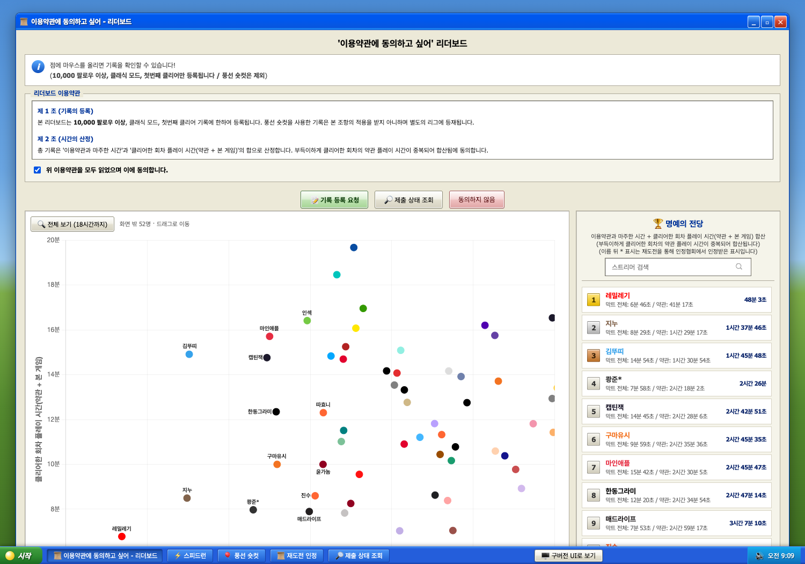
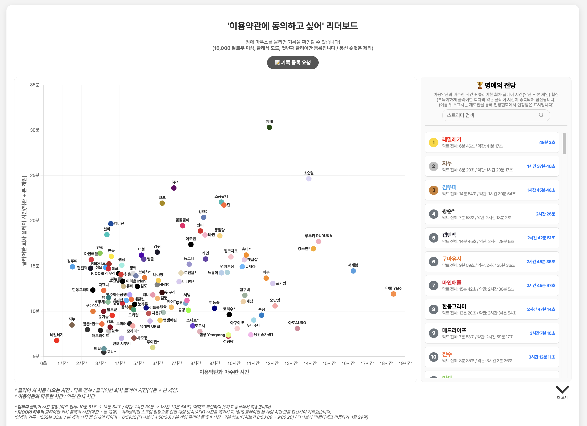
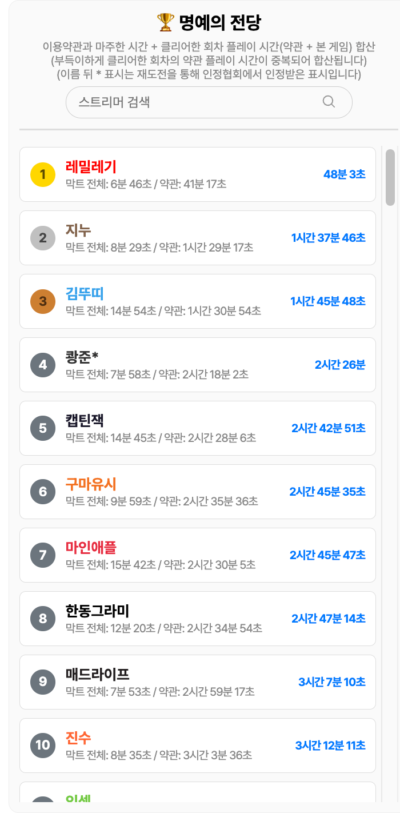
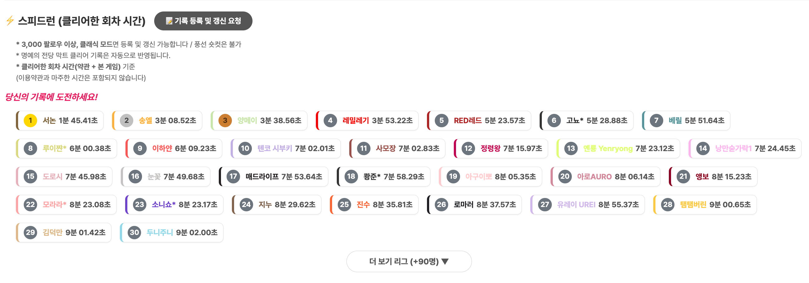
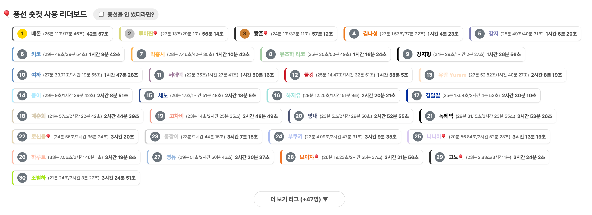
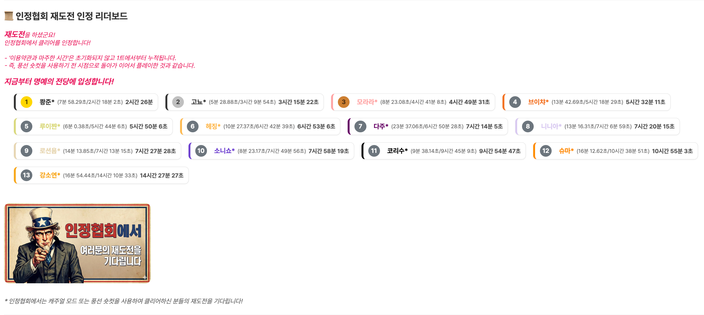
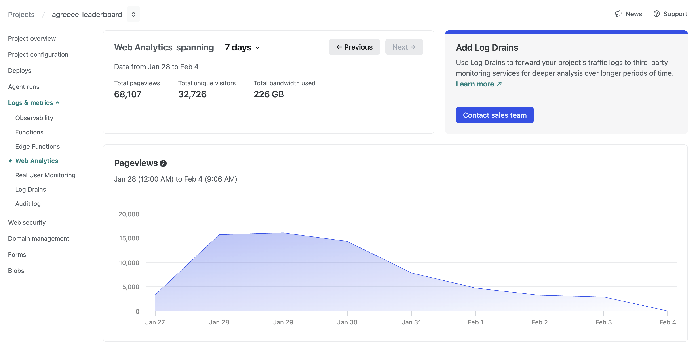
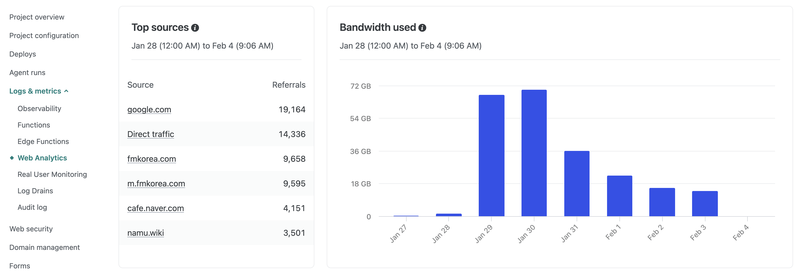
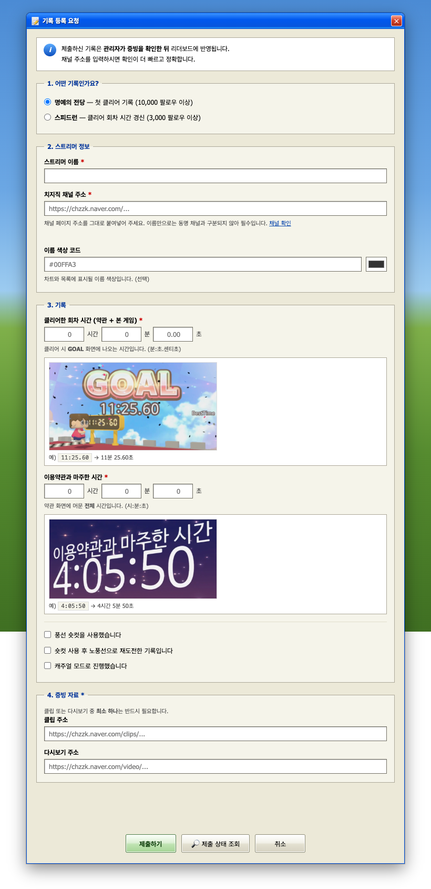
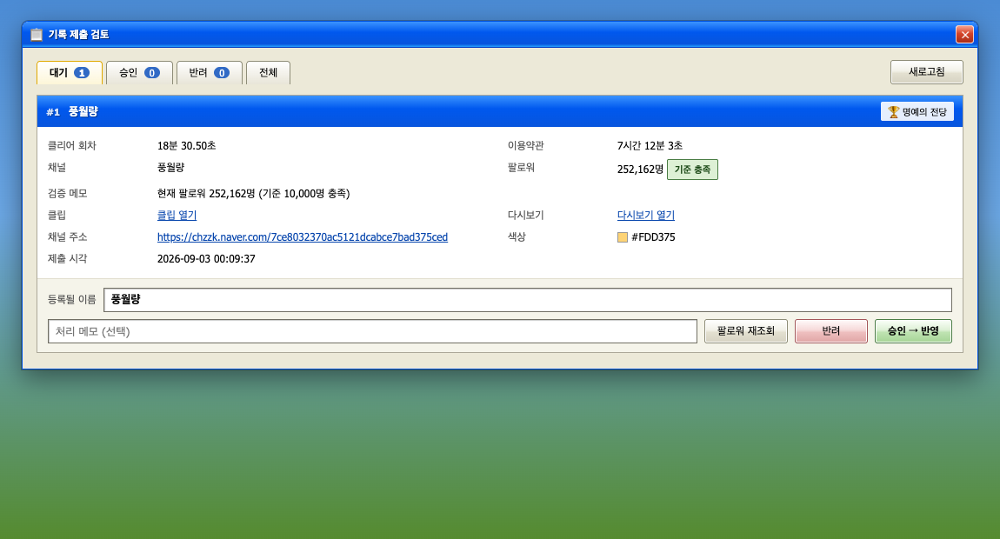

# 🏆 '이용약관에 동의하고 싶어' 스트리머 리더보드

네이버 스트리밍 플랫폼 치지직 스트리머(인터넷 방송인)들의 **'이용약관에 동의하고 싶어'** 게임 클리어 기록을 시각화하고 모아둔 웹 리더보드 프로젝트입니다.

🔗 **Live Demo:** [https://agreeee-leaderboard.netlify.app](https://agreeee-leaderboard.netlify.app)

<div align="center">
  
</div>

## ✨ 주요 기능

- **게임 UI 재현:** 원작 게임이 사용하는 **Windows XP Luna 테마**를 차용해, 리더보드 자체가 게임 화면처럼 보이도록 구성했습니다. 각 리그는 창(Window)으로 표현되고 작업 표시줄로 이동할 수 있습니다.
- **기록 시각화 차트:** '이용약관과 마주한 시간'을 X축, '클리어한 회차 플레이 시간(본 게임 시간)'을 Y축으로 둔 산점도 차트를 제공합니다. 확대/전체 보기 전환과 드래그 이동을 지원합니다.
- **스트리머 검색:** 특정 스트리머를 검색해 목록과 차트에서 동시에 하이라이트하며, 화면 밖에 있으면 차트가 해당 위치로 이동합니다.
- **기록 등록 요청:** 자체 제출 폼으로 요청을 받고, 관리자 검토를 거쳐 반영합니다. 제출자는 처리 상태를 직접 조회할 수 있습니다.

> 기존 UI가 익숙하신 분을 위해 **구버전 UI 토글**을 제공합니다. 선택은 브라우저에 저장되어 다음 방문에도 유지됩니다.
>
> <div align="center">
>   
> </div>

### 🏆 분할 리그 시스템

기록의 공정성과 다양한 재미를 위해 플레이 방식에 따라 리그를 분할하여 제공합니다.

#### 1. 명예의 전당 (Hall of Fame)

<div align="center">
  
</div>

- **조건:** 10,000 팔로워 이상, 클래식 모드 첫 클리어 기록
- 수많은 시청자들 앞에서 험난한 이용약관을 뚫고 첫 클리어를 달성한 대형 스트리머들의 끈기와 노력이 담긴 명예로운 리더보드입니다.

#### 2. 스피드런 (Speedrun)

<div align="center">
  
</div>

- **조건:** 3,000 팔로워 이상, 클래식 모드 (풍선 숏컷 제외)
- 오직 **'순수 클리어 회차 시간'** 만으로 한계에 도전하는 스피드런 리그입니다.

#### 3. 풍선 숏컷 사용 리더보드

<div align="center">
  
</div>

- 풍선 숏컷을 사용하여 클리어한 유저들을 위해 별도로 마련된 리더보드입니다.

#### 4. 재도전 인정 리더보드

<div align="center">
  
</div>

- 캐주얼 모드나 풍선 숏컷을 사용했던 유저가 클래식 모드로 **재도전**하여 클리어한 기록입니다.
- 1회차 클리어 때 소요된 이용약관 시간을 초기화하지 않고 누적 합산하여 '인정협회'의 엄격한 기준을 통과한 명예로운 기록들입니다.

## 📊 트래픽 및 성과

단일 게임 팬 웹사이트임에도 배포 직후 많은 분들의 관심을 받아 꽤 높은 트래픽을 기록했습니다.

<div align="center">
  
</div>
<div align="center">
  
</div>

- **집계 기간:** 2026년 1월 28일 ~ 2월 4일 (7일간)
- **방문자 성과:** 총 68,107회의 페이지뷰(Pageviews)와 32,726명의 순 방문자(Unique Visitors) 달성
- **주요 유입 경로:** 구글 검색(19,164회), 직접 유입(14,336회)을 비롯해 에펨코리아, 네이버 팬카페, 나무위키 등 여러 커뮤니티를 통해 성공적으로 바이럴이 되었습니다.
- **대역폭 사용량:** 트래픽이 몰렸던 1월 29일~30일 이틀 동안만 하루 70GB 이상, 총 226GB의 대역폭을 소화했습니다.

## 📝 데이터 수집 및 검증

기록의 신뢰성을 위해 모든 데이터는 **증빙(다시보기·클립) 확인 후 등록**합니다.

- **1기:** 커뮤니티 제보를 모은 뒤, 해당 방송의 다시보기, 클립, 라이브 화면을 일일이 확인하여 등록했습니다.
- **2기:** 네이버 폼으로 등록 요청을 받고, 다시보기 및 클립으로 2차 검증을 마친 후 수동으로 `data.js`에 반영했습니다.
- **3기(현재):** 자체 제출 폼과 검토 서버를 구축해, 제출부터 반영까지의 과정을 자동화했습니다.

### 제출 → 검토 → 반영 파이프라인

<div align="center">
  
  
</div>

1. **제출** — 시간을 시/분/초로 분리 입력받아 표기 흔들림을 없앴고, 치지직 채널 URL과 증빙(클립·다시보기)을 필수로 받습니다.
2. **자동 검증** — 치지직 API로 채널을 조회해 팔로워 수를 확인하고, 제출한 이름과 실제 채널명이 다르면 경고합니다.
3. **검토** — 관리자가 증빙을 확인하고 승인/반려합니다. 승인 시 이름을 정정할 수 있고, 리그별 표기(`*`, `🎈`)가 자동으로 붙습니다.
4. **발행** — 승인된 기록을 모아 한 번에 커밋·푸시하면 Netlify가 배포합니다.

제출자는 접수 번호나 스트리머 이름으로 처리 상태를 직접 조회할 수 있습니다.

<div align="center">
  
</div>

## 🛠 기술 스택

### Frontend


### Library


### Backend (제출·검토 서버)


### Deployment


## 📁 프로젝트 구조

```
.
├── index.html / index.css / index.js   공개 리더보드 (정적)
├── theme-xp.css                        신버전 XP(Luna) 테마
├── data.js                             기록 데이터 (단일 원본)
├── submit.html / submit.js / submit.css   기록 등록 요청 폼
├── status.html / status.js             제출 상태 조회
└── server/                             제출·검토 서버 (OCI)
    ├── src/
    │   ├── server.js       API 라우팅
    │   ├── db.js           SQLite (제출 저장)
    │   ├── chzzk.js        치지직 채널·팔로워 조회
    │   ├── dataFile.js     data.js 읽기/쓰기 (추가·삭제)
    │   ├── git.js          커밋·발행
    │   ├── validate.js     입력 검증·자동 판정
    │   ├── captcha.js      Cloudflare Turnstile
    │   └── notify.js       Discord 알림
    ├── public/admin/       관리자 검토 화면
    └── deploy/             OCI 배포 스크립트·가이드
```

서버 설치와 운영은 [server/README.md](server/README.md), OCI 배포는 [server/deploy/README.md](server/deploy/README.md)를 참고하세요.

## 💡 기술적 의사결정 및 트러블슈팅

### 1. 오버 엔지니어링 지양 및 빠른 배포 우선 (DB-less Architecture)

인터넷 방송 생태계 특성상 밈(Meme)의 유행 주기가 짧기 때문에, 완벽한 백엔드 구조를 잡는 것보다 **타이밍을 맞춘 빠른 런칭**이 제일 중요하다고 판단했습니다.
외부 DB(Supabase, Firebase 등) 연동에 리소스를 쏟는 대신 순수 정적 파일(`data.js`)로 데이터를 관리하고 Netlify로 즉시 배포했습니다. 그 결과 트래픽이 터지는 적기에 서비스를 오픈할 수 있었고, 7일간 68,107 페이지뷰와 226GB 대역폭을 서버 없이 소화했습니다.

### 2. 서버를 추가하면서도 정적 구조를 지킨 이유

이후 제출·검토 자동화를 위해 서버가 필요해졌지만, **공개 리더보드는 여전히 정적 파일이 서빙합니다.**

승인 시 서버가 DB를 고치는 대신 `data.js`를 수정해 Git에 커밋하고, Netlify가 이를 감지해 배포하는 구조를 택했습니다.

- 공개 트래픽은 100% Netlify가 받으므로 **OCI 프리티어(1 OCPU / 1GB)에 부하가 없습니다.** 밈이 다시 유행해도 서버가 병목이 되지 않습니다.
- **서버가 죽어도 리더보드는 계속 서비스됩니다.** 제출과 검토만 일시적으로 중단됩니다.
- 데이터 변경 이력이 Git에 그대로 남아 **아카이빙 목적에도 부합**합니다.

리더보드의 '검토 중' 섹션처럼 서버 데이터를 쓰는 부분도, 서버가 응답하지 않으면 해당 섹션만 조용히 숨기고 나머지는 정상 동작하도록 만들었습니다.

### 3. 배포 크레딧을 고려한 발행 방식

Netlify는 production 배포 1회당 크레딧을 소모합니다(기본 제공 300, 1회 15). 승인할 때마다 푸시하면 **승인 10건 = 배포 10회 = 150 크레딧**으로 한 달 할당량의 절반이 사라집니다.

그래서 승인 시에는 `data.js`만 수정해 두고, **커밋·푸시는 모아서 한 번만** 하도록 분리했습니다. 같은 10건이라도 발행 1회면 15 크레딧으로 끝납니다. 관리자 화면에 미발행 건수와 목록을 띄우고, Discord 알림에도 함께 표시해 발행을 잊지 않도록 했습니다.

### 4. 팔로워 자동 검증의 한계를 인정한 설계

치지직 API로 팔로워 수를 조회해 등록 기준(10,000 / 3,000) 충족 여부를 자동 판정합니다. 다만 두 가지 한계를 설계에 반영했습니다.

- **시점 불일치** — API가 주는 값은 '현재' 팔로워인데 기준은 '클리어 시점'입니다. 그래서 기준 ±20% 구간은 자동 판정하지 않고 관리자 확인으로 넘깁니다.
- **동명 채널** — 이름 검색은 오매칭 위험이 큽니다(실측: `슈네1` 검색 시 팔로워 1명짜리 `슈네11`이 상위 노출, `풍월량`은 252,158명과 22명 두 채널이 존재). 따라서 채널 URL을 필수로 받아 채널 ID로 조회하고, 이름만으로는 후보를 제시해 사람이 고르게 합니다.

비공식 API라 언제든 바뀔 수 있으므로, **조회에 실패해도 제출 자체는 정상 접수**되고 관리자 화면에 '확인 필요'로 표시됩니다.

### 5. UX 개선: FOUT(Flash of Unstyled Text) 현상 해결

외부 웹 폰트(Pretendard) 로딩이 지연되면서 기본 폰트가 먼저 떴다가 깜빡이며 바뀌는 FOUT 현상이 시각적인 불편함을 주었습니다.
이를 해결하기 위해 HTML에 `<link rel="preconnect">`를 적용해 폰트 연결 속도를 높였고, 초기 `body`의 투명도(`opacity`)를 0으로 두었습니다. 이후 JS의 `document.fonts.ready` API를 사용해 폰트 다운로드가 끝난 시점에 `fonts-loaded` 클래스를 붙여 화면이 부드럽게(Fade-in) 뜨도록 처리했습니다.
추가로, 사용자의 네트워크 환경이 열악해 폰트 로딩이 무한정 길어질 경우를 대비해 `setTimeout`으로 0.5초 뒤에는 강제로 화면이 보이도록 Fallback(방어 코드)을 적용해 UX를 개선했습니다.

## ⚠️ Disclaimer

- 본 프로젝트는 특정 게임과 인터넷 방송 팬 문화를 바탕으로 제작된 **비영리 목적의 팬 프로젝트**입니다.
- 리더보드에 기재된 스트리머 분들의 닉네임 및 관련 방송 기록에 대한 권리는 각 스트리머 본인에게 있습니다.
- 닉네임 노출이나 기록에 대해 수정 및 삭제를 원하시는 경우, 언제든 연락(Issue 등) 주시면 즉시 반영하겠습니다.

## 📜 라이선스 (License)

이 프로젝트는 **MIT License**를 따릅니다. 자세한 내용은 [LICENSE](LICENSE) 파일을 확인해 주세요.
